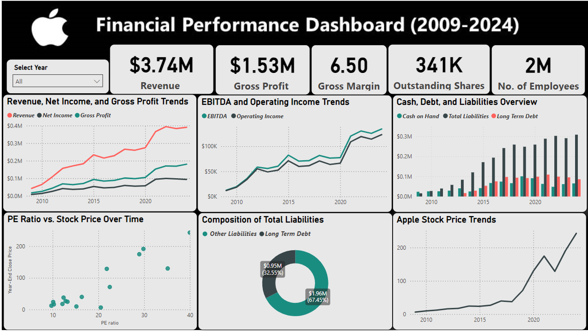

# apple-dashboard

 Power BI Dashboard showcasing the financial performance of Apple Inc. (2009-2024)! 

This interactive dashboard includes:
✅ Trend Analysis: Line charts for Revenue, Net Income, and Gross Profit trends.
✅ Profitability Metrics: Bar charts for EBITDA and Operating Income.
✅ Liquidity Overview: Stacked bar charts for Cash, Debt, and Liabilities.
✅ Valuation Insights: Scatter plot for PE Ratio vs. Stock Price over time.
✅ Stock Price Trends: Line chart for Apple’s stock price performance.
✅ Liabilities Breakdown: Pie chart for the composition of Total Liabilities.

I also designed the custom background for the dashboard using Microsoft PowerPoint to give it a polished and professional look.

This project was a great opportunity to enhance my data visualization and storytelling skills while diving deep into Apple’s financials. Looking forward to applying these skills to more real-world data challenges!

## Screenshots

